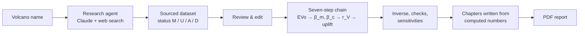

# 🌋 Volcano Compressibility Agent

[](https://colab.research.google.com/github/FreyaMare/volcano-compressibility-agent/blob/main/notebooks/Volcano_Agent_Colab.ipynb)
[](https://github.com/FreyaMare/volcano-compressibility-agent/actions/workflows/tests.yml)
[](LICENSE)

**Type the name of a volcano. The agent reads the published literature, runs the magma-compressibility →
surface-deformation chain, and returns a thesis-style PDF report.**

**Author:** Freya Mohammadian · [github.com/FreyaMare](https://github.com/FreyaMare)

It generalises the code of the MSc thesis *From magma compressibility to surface deformation at La Fossa
volcano (Vulcano Island, Italy)* — [`FreyaMare/lafossa-magma-compressibility`](https://github.com/FreyaMare/lafossa-magma-compressibility) —
from one volcano to any volcano (thesis code archived as [10.5281/zenodo.22898423](https://doi.org/10.5281/zenodo.22898423)). On the La Fossa dataset the generalised engine reproduces every r<sub>V</sub>
and uplift value of the thesis to better than 10⁻⁶ (relative).

📖 **[User guide, step by step](docs/USER_GUIDE.md)** — what it does, buying an API key, uploading to GitHub,
running in Colab, locally or online, reading the report, troubleshooting.

📄 **[Example report (La Fossa)](docs/example_report_LaFossa.pdf)** · **[Data specification](docs/DATA_SPEC.md)** ·
**[Methods](docs/METHODS.md)**

---

## What it does



1. **Research.** Three focused agent stages with web search and page reading — the volcanic system and its
   storage levels; unrest, InSAR/GNSS and the published analytical source model; the petrology of each magma
   (major elements, temperature, melt-inclusion H₂O, CO₂, S). Every number carries its value, published range,
   source (paper + table) and status: **M** measured · **U** detection limit · **A** adopted · **D** generic default.
2. **Review.** Edit any value before the analysis (app or notebook).
3. **Seven-step chain** of the thesis: P = ρgz → EVo (C–O–H–S saturation, φ, fugacities) → β<sub>m</sub>
   (frozen and equilibrium) → β<sub>c</sub> (sphere, prolate spheroid, penny crack) → r<sub>V</sub> → ΔV<sub>c</sub>
   → Mogi / Yang / Fialko uplift at 0, 1, 2 km; plus the inverse analysis (volume and overpressure for 10 mm),
   the 10 MPa screen, the thin-crack check, verification against closed forms, consistency with the published
   source, and sensitivities (Scenario B volatiles, pressure datum × H₂O, density, redox, aspect ratio, μ, ν).
4. **Report.** Claude drafts the chapters from the computed facts only; every number in the text is audited.
   The PDF has a title page with a provenance box, contents, abstract, Chapters 1–7, ≈15 tables, 6 figures,
   references and appendices (complete results, provenance of every input, research log, number audit).

## Quick start

You need an **Anthropic API key** (Console → *Settings → Billing → Buy credits*, then *Settings → API keys*;
see the guide, Section 4). The API is billed separately from Claude.ai subscriptions.

### Google Colab — nothing to install
Click **Open in Colab** above → store the key as the Colab secret `ANTHROPIC_API_KEY` (🔑 in the left bar) →
type the volcano in cell 2 → *Runtime ▸ Run all*. The last cell runs the La Fossa demo without a key.

### Web app on your computer
Requires Python 3.12 and Git.
```bash
git clone https://github.com/FreyaMare/volcano-compressibility-agent.git
cd volcano-compressibility-agent
python -m venv .venv && source .venv/bin/activate      # Windows: .venv\Scripts\activate
pip install -r requirements.txt
streamlit run app.py
```

### Web app online (Streamlit Community Cloud)
Deploy this repository with `app.py` as the main file and Python 3.12. In the app *Secrets*, either leave the key
out (each visitor pastes their own) or set both `ANTHROPIC_API_KEY` and `APP_PASSWORD` — the stored key is used
only after the password is entered and is never sent to the browser. See `.streamlit/secrets.toml.example`.

### Python
```python
from volcano_agent.pipeline import run_agent
rr = run_agent("Campi Flegrei", api_key="sk-ant-...")
open("report.pdf", "wb").write(rr.pdf)
```

## Reading the output responsibly

* Every **D** input is listed in Section 4.7 of the report and counted on the title page, together with the caveats
  raised by the calculation itself (e.g. cracks wider than deep, EVo outside its calibrated temperature range).
* The research is automated. The agent is instructed never to invent numbers and to cite the table each one comes
  from, but extraction can still be wrong: check the key inputs (shallow-reservoir H₂O, storage depths, published
  source parameters) against the papers cited in Appendix B.
* The physics carries the thesis assumptions: homogeneous elastic half-space, static response, ideal gas, one
  reservoir per level, frozen / equilibrium compressibility end-members.
* A magmatic calculation at a source its authors interpret as hydrothermal is labelled a hypothetical end-member.

## Cost

Per the [official pricing](https://platform.claude.com/docs/en/about-claude/pricing): Opus 5.5 $4 / $20 and
Sonnet 5.5 $2 / $10 per million input / output tokens; web search $10 per 1000 searches. A "standard" run makes
roughly 70–90 searches; a rough estimate is $5–15 per volcano with Opus and about half with Sonnet. Check the
Console *Usage* page after your first run and set a spend limit. Re-running from a saved dataset JSON costs no
search.

## Repository structure

```
app.py                          Streamlit app
notebooks/Volcano_Agent_Colab.ipynb
volcano_agent/
  research.py   llm.py          literature-research agent and Claude tool loop
  schema.py     defaults.py     dataset with provenance; generic defaults and finalize()
  physics.py    chain.py        EVo + elastic sources (thesis code); scenario matrix, inverse, checks, sensitivities
  facts.py      writer.py       facts for the writer and number audit; chapter writer
  templates.py  figures.py      fixed text; figures
  report_pdf.py pipeline.py     PDF; orchestration
  reference/lafossa.json        the thesis dataset (regression test and demo)
tests/                          thesis regression; edge cases; end-to-end agent with a fake Claude client
docs/                           user guide, data specification, methods, example report
paper/                          experiments and figures of the accompanying manuscript
.github/workflows/tests.yml     CI
.streamlit/                     theme; secrets example
packages.txt                    git for Streamlit Cloud (EVo is cloned at run time)
```

## Tests

```bash
pip install pytest
pytest -v tests/          # VOLCANO_AGENT_EVO_DIR=/path/to/EVo reuses an existing EVo checkout
```

## How to cite

If you use this software, please cite both the software and the thesis it is based on:

> Mohammadian, Freya (2026). *Volcano Compressibility Agent* (version 1.1.0) [software].
> https://github.com/FreyaMare/volcano-compressibility-agent

> Mohammadian, Freya (2026). *From magma compressibility to surface deformation at La Fossa volcano
> (Vulcano Island, Italy)*. MSc thesis, University of Naples Federico II.

GitHub's **Cite this repository** button (from `CITATION.cff`) gives the same reference in APA and BibTeX. Please
also cite the underlying tools: EVo (Liggins et al. 2020, 2022), dMODELS (Battaglia et al. 2013) and the source
models (Mogi 1958; Yang et al. 1988; Fialko et al. 2001).

## Licence

Copyright © 2026 Freya Mohammadian. Released under the GNU General Public License v3.0 or later (EVo, imported at run
time, is GPL-3.0). See [`LICENSE`](LICENSE).
