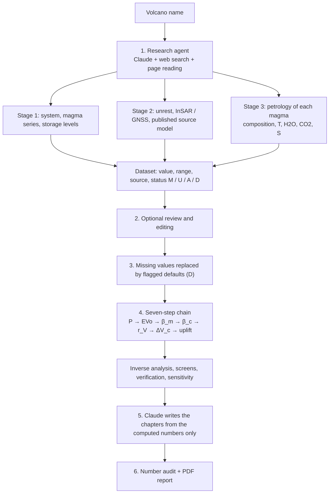

# User guide — Volcano Compressibility Agent

A step-by-step guide: what the tool does, how to buy and enter an API key, how to put the project on GitHub, and
how to run the agent in Google Colab, on your own computer, or as a public web app.

> The complete technical specification (every input, default, scenario and output) is in
> [`DATA_SPEC.md`](DATA_SPEC.md); the equations are in [`METHODS.md`](METHODS.md).

---

## Contents

1. [At a glance](#1-at-a-glance)
2. [What the tool does](#2-what-the-tool-does)
3. [What you need](#3-what-you-need)
4. [Create an account, buy credits and get an API key](#4-create-an-account-buy-credits-and-get-an-api-key)
5. [Put the project on GitHub](#5-put-the-project-on-github)
6. [Run it in Google Colab (easiest)](#6-run-it-in-google-colab-easiest)
7. [Run the web app on your computer](#7-run-the-web-app-on-your-computer)
8. [Publish the web app online (Streamlit Community Cloud)](#8-publish-the-web-app-online-streamlit-community-cloud)
9. [Using the app, step by step](#9-using-the-app-step-by-step)
10. [Outputs and how to read the report](#10-outputs-and-how-to-read-the-report)
11. [Data and scientific specification](#11-data-and-scientific-specification)
12. [Code structure](#12-code-structure)
13. [Verification and tests](#13-verification-and-tests)
14. [Cost](#14-cost)
15. [Troubleshooting](#15-troubleshooting)
16. [FAQ](#16-faq)
17. [Citation and licence](#17-citation-and-licence)

---

## 1. At a glance

| | |
|---|---|
| **Input** | the name of a volcano, e.g. `Campi Flegrei` |
| **What the agent does** | searches the scientific literature, extracts the inputs with their sources, runs the seven-step chain of the La Fossa thesis, writes the report |
| **Output** | thesis-style PDF report (English) + dataset with provenance (JSON) + complete results (CSV) |
| **Run time** | about 5–20 minutes, depending on the research depth |
| **Requirement** | an Anthropic API key (paid, prepaid credits) |
| **Where it runs** | Google Colab, or a Streamlit web app (on your computer or online) |

---

## 2. What the tool does

The thesis showed that the magma volume inferred from ground uplift depends on how compressible the magma is
(above all, on its exsolved gas) and on the shape of the reservoir, through the factor
r<sub>V</sub> = 1 + β<sub>m</sub>/β<sub>c</sub>. This tool carries out the same calculation for **any volcano**;
the inputs that were compiled by hand for La Fossa are now found by an AI agent.



**In plain words**

1. **Research.** The agent works in three stages:
   - the **volcanic system**: location, history, magma types and storage depths;
   - **ground deformation**: unrest, InSAR and GNSS data, and the source model published for it;
   - **petrology**: for each magma, its composition, temperature and dissolved H₂O, CO₂ and S.

   It opens and reads the papers. Every number gets its value, published range, source (paper and table) and a
   status code.
2. **Review.** You can see and correct the data before the calculation.
3. **Completion.** Anything not found is replaced by a generic value, marked **D**, and listed in the report.
4. **Calculation.** Exactly the thesis code: EVo, the frozen and equilibrium compressibility branches, the Mogi,
   Yang and Fialko sources, the inverse analysis for 10 mm of uplift, the 10 MPa screen, the thin-crack check,
   verification tests and all the sensitivity analyses of the thesis.
5. **Writing.** Claude writes the chapters only from the computed numbers; it is not allowed to add others.
6. **Number check.** Every number in the text is compared automatically with the computed results; any that
   cannot be matched is listed in Appendix C of the report.

---

## 3. What you need

| Item | Purpose | Cost |
|---|---|---|
| **Anthropic Console** account + credits | literature research and report writing | prepaid (Section 4) |
| **GitHub** account | storing and publishing the code | free |
| **Google** account | running in Colab | free |
| (optional) **Streamlit Community Cloud** account | publishing the web app | free |
| (optional) **Python 3.12** and **Git** on your computer | running the app locally | free |

> A Claude.ai subscription (Pro or Max) does **not** include API usage. The API is billed separately, with prepaid
> credits bought in the Console.

---

## 4. Create an account, buy credits and get an API key

### 4.1 Create an account
1. Go to [platform.claude.com](https://platform.claude.com).
2. Sign up with an e-mail address or a Google account, and sign in.

### 4.2 Buy credits
1. In the Console, open **Settings → Billing**.
2. Click **Buy credits**, enter an amount and a payment card. **$10–20** is enough to start (see Section 14).
3. Good to know:
   - credits expire **one year** after purchase and are non-refundable;
   - **Auto-reload** can top up the balance automatically when it falls below a threshold. Not recommended while
     you are starting out.

### 4.3 Set a spend limit (strongly recommended)
1. On the same **Settings → Billing** page, find **Spend limits**.
2. Click **Set limit** (or **Adjust limit**).
3. Enter a monthly cap, e.g. $20, so that you can never spend more than that.

### 4.4 Create the key
1. Open [Settings → API keys](https://platform.claude.com/settings/keys).
2. Click **Create key**, give it a name (e.g. `volcano-agent`) and an expiry date, then **Create**.
3. **Copy the key immediately** — it starts with `sk-ant-` and is shown only once. Keep it somewhere safe,
   such as a password manager.

### 4.5 Where the key goes

| Environment | Where to enter the key | Section |
|---|---|---|
| Google Colab | 🔑 Secrets, name `ANTHROPIC_API_KEY` | 6 |
| App on your computer | the key field in the app's sidebar, or `.streamlit/secrets.toml` | 7 |
| App online (Streamlit Cloud) | the app's *Secrets* (with a password), or each visitor enters their own key | 8 |

### 4.6 Key safety ⚠️
- **Never** put the key in the code, in a notebook or on GitHub: anyone who has it spends your credits.
- `.streamlit/secrets.toml` is listed in `.gitignore`, so it cannot be uploaded to GitHub by accident.
- If a key leaks: **delete** it in **Settings → API keys** and create a new one.

---

## 5. Put the project on GitHub

### 5.1 Create an empty repository
1. On [github.com](https://github.com), click **+** (top right) → **New repository**.
2. Repository name: `volcano-compressibility-agent`
3. Description: `AI agent: from the published literature to magma-compressibility and surface-deformation reports for any volcano`
4. Choose **Public** (Colab can download a public repository without a password).
5. Do **not** tick README, .gitignore or licence — the project already contains them.
6. Click **Create repository**.

### 5.2 Option A: upload through the browser (nothing to install)
1. Extract `volcano-compressibility-agent.zip` on your computer.
2. On the empty repository page, click **uploading an existing file**.
3. Open the folder `volcano-compressibility-agent`, select **everything inside it** and drag it onto the GitHub
   page. Do not drag the outer folder itself.
4. **Hidden items:** `.github`, `.streamlit` and `.gitignore` start with a dot and are hidden by default.
   - **macOS:** press <kbd>Cmd</kbd>+<kbd>Shift</kbd>+<kbd>.</kbd> in Finder to show them.
   - **Windows:** in File Explorer, *View → Show → Hidden items*.
5. Write the message `First release` and click **Commit changes**.
6. Check that `volcano_agent`, `docs`, `notebooks`, `tests`, `app.py`, `README.md`, `requirements.txt` and
   `packages.txt` are visible in the repository.

### 5.3 Option B: Git on the command line
```bash
cd volcano-compressibility-agent
git init
git add .
git commit -m "First release"
git branch -M main
git remote add origin https://github.com/FreyaMare/volcano-compressibility-agent.git
git push -u origin main
```
On the first `push`, GitHub asks you to sign in through the browser. If your user name is not `FreyaMare`,
change it in the command.

### 5.4 After the upload
- **Topics:** click the gear next to **About** and add `volcanology`, `volcano-monitoring`, `insar`, `magma`,
  `ai-agent`, `claude`.
- **Automatic tests:** open the **Actions** tab and, if asked, enable workflows. From then on every change runs
  the test suite, including the reproduction of the thesis results; a green ✅ means it passed.
- **Release (optional):** *Releases → Create a new release* with tag `v1.0.0`. If you connect
  [Zenodo](https://zenodo.org) to GitHub, the release gets a citable DOI.
- **Different user or repository name?** Replace `FreyaMare/volcano-compressibility-agent` in:
  - `README.md`
  - `CITATION.cff`
  - cell 1 of the notebook (`REPO_URL`)
  - this guide.

---

## 6. Run it in Google Colab (easiest)

### First time
1. Open the notebook, either way:
   - click **Open in Colab** in the README on GitHub; or
   - go to [colab.research.google.com](https://colab.research.google.com), *File → Upload notebook*, and choose
     `notebooks/Volcano_Agent_Colab.ipynb`.
2. Store the key:
   1. In the left bar, click **🔑 (Secrets)** → **Add new secret**.
   2. **Name:** `ANTHROPIC_API_KEY`
   3. **Value:** paste your `sk-ant-…` key.
   4. Switch **Notebook access** on.

### Every run
Each cell has a ▶️ button on its left. Run the cells in order and wait for each to finish.

| Cell | What it does | Notes |
|---|---|---|
| **1** | install | downloads the code from GitHub and installs EVo and the libraries (1–2 min). If the repository cannot be reached, a **Choose Files** button appears: pick the zip file. |
| **2** | settings | type the volcano name in English in `VOLCANO`; choose the model and research depth. If Colab asks for access to the secret, click **Grant access**. |
| **3** | literature research | takes a few minutes; searches are printed as they happen, then a table of the data with sources and status codes. |
| **4** | corrections (optional) | correct any wrong value here (examples are in the cell); otherwise just run it. |
| **5** | calculation and report | shows tables and figures and downloads the PDF. |
| **last** | La Fossa demo | runs without a key; try it first to check that the installation works. |

> Colab deletes files when the session ends: start again from cell 1 each time. The stored secret is kept.
> If the PDF does not download by itself: click the folder icon 📁 on the left, right-click the file, *Download*.

---

## 7. Run the web app on your computer

The web app is a page with a text box: you type the volcano, review the data in tables, and download the PDF.

### 7.1 Install the tools (first time only)
1. **Python 3.12** from [python.org/downloads](https://www.python.org/downloads/).
   - On Windows, tick **Add python.exe to PATH** on the first installer screen.
2. **Git** from [git-scm.com](https://git-scm.com/downloads) — needed to download EVo automatically.

### 7.2 Download the project and install the libraries
Open **PowerShell** (Windows) or **Terminal** (macOS), then:

```bash
git clone https://github.com/FreyaMare/volcano-compressibility-agent.git
cd volcano-compressibility-agent
python -m venv .venv
```
Activate the virtual environment:
- **Windows:** `.venv\Scripts\activate`
  - if you see "running scripts is disabled", run once
    `Set-ExecutionPolicy -Scope CurrentUser RemoteSigned` and try again.
- **macOS / Linux:** `source .venv/bin/activate`

Then:
```bash
pip install -r requirements.txt
streamlit run app.py
```
The browser opens `http://localhost:8501`.

### 7.3 Enter the key
- **Simple:** paste the key into **Your Anthropic API key** in the sidebar each time.
- **Permanent:**
  1. copy `.streamlit/secrets.toml.example` to `.streamlit/secrets.toml`;
  2. write your key in it.

  This file is never uploaded to GitHub.

Next time you only need to: open the project folder, activate the virtual environment and run
`streamlit run app.py`.

---

## 8. Publish the web app online (Streamlit Community Cloud)

This gives you a link such as `https://volcano-agent.streamlit.app` that anyone can open.

1. Go to [share.streamlit.io](https://share.streamlit.io), click **Continue with GitHub** and authorise it.
2. Click **Create app** → **Deploy a public app from GitHub**.
3. Fill in:

| Field | Value |
|---|---|
| Repository | `FreyaMare/volcano-compressibility-agent` |
| Branch | `main` |
| Main file path | `app.py` |
| App URL | any name, e.g. `volcano-agent` |

4. Open **Advanced settings**:
   - **Python version:** **3.12**;
   - **Secrets:** one of the two options below.
5. Click **Deploy**. The first start takes a few minutes; `packages.txt` installs Git so that EVo can be downloaded.

### ⚠️ Important: protect your credits on a public app
If your key is stored in the Secrets, **anyone with the link could use your credits**. Two safe set-ups:

**Option 1 (recommended):** store the key together with a password. Only people who know the password can use
your key; everyone else must paste their own:
```toml
ANTHROPIC_API_KEY = "sk-ant-..."
APP_PASSWORD = "a-long-password-nobody-can-guess"
```

**Option 2:** leave the Secrets empty. Every visitor pastes their own key in the sidebar.

The code never sends the stored key to the visitor's browser, and in option 1 it is not used without the correct
password. Set the spend limit of Section 4.3 anyway.

> To restrict who can even open the app: in Streamlit Cloud, *Settings → Sharing*, make it private and list the
> e-mail addresses allowed to view it.

---

## 9. Using the app, step by step

1. **Sidebar:**
   - enter your key (or the app password, if the owner set one);
   - **Model:** `claude-opus-5-5` is the most careful; `claude-sonnet-5-5` is cheaper and faster;
   - **Research depth:** `quick`, `standard` or `thorough`;
   - keep **Let me review…** ticked.
2. Type the volcano name **in English** and click **Run agent**. The searches appear live.
3. **Review page:**
   - **Magmas:** temperature and H₂O, CO₂, S with their status (drop-down M/U/A/D) and source;
   - **Storage levels:** depths and the resident and injected magma (rows can be added or deleted);
   - **Published deformation source:** an expandable JSON editor.

   Correct anything that does not match the papers, and update its status and source.
4. Click **Run analysis and write the report**.
5. **Downloads:**
   - **PDF report**;
   - **Dataset (JSON)** — reload it later to recompute without paying for the research again;
   - **Complete results (CSV)**.
6. **Without a key:**
   - **Load the La Fossa thesis dataset (demo)** builds the full La Fossa report (chapter text is a placeholder);
   - **load a saved dataset** re-opens a JSON file saved earlier.

---

## 10. Outputs and how to read the report

### Structure of the PDF
| Part | Content |
|---|---|
| Title page | title, a "how this report was produced" box, and the number of flagged inputs |
| Abstract, Chapter 1 | the problem, the volcano, five research questions, the method |
| Chapter 2 | the volcanic system: storage-level table, cross-section, volatile table |
| Chapter 3 | theoretical framework and equations |
| Chapter 4 | compositions, parameters with status codes, scenario matrix, Scenario B, verification, **4.7 data gaps and calculation caveats** |
| Chapter 5 | results: magmatic state, r<sub>V</sub>, volume change, uplift, inverse analysis, sensitivity (6 figures) |
| Chapters 6–7 | discussion, conclusions, answers to the research questions |
| References | literature on the volcano and method references |
| Appendices A, B, C | complete results, **provenance of every input**, research log and **number audit** |

### Symbols and warnings
- **M / U / A / D:** measured, detection limit, adopted representative value, generic default. A result that
  depends on a D input is less certain.
- **†:** crack configuration that violates the thin-crack condition — an idealisation, not a real sill.
- **‡:** crack whose radius equals its depth — at the validity limit of the solution.
- **Hypothetical magmatic end-member:** if the authors interpret the deformation source as hydrothermal, the
  magmatic calculation at that geometry is a hypothetical case.
- **Section 4.7** also lists caveats produced by the calculation itself: cracks wider than deep (not modelled),
  states where EVo used temperature-independent solubility coefficients or did not converge, equilibrium branch
  below the frozen branch at high pressure, and spheres that are large relative to their depth.
- **Appendix C, number audit:** if a number is listed there, check the sentence that contains it.

> **Important:** automated research can misread a number. Before any scientific use, check at least these inputs
> against the original papers:
> - the water content of the shallow magma;
> - the storage depths;
> - the parameters of the deformation source.
>
> Appendix B gives the exact source (paper and table) of each.

---

## 11. Data and scientific specification

A summary; the full specification is in [`DATA_SPEC.md`](DATA_SPEC.md).

| Topic | Specification |
|---|---|
| Reservoirs | up to 3 magmatic levels, plus the published deformation source if there is one |
| Geometries | Mogi sphere; penny cracks of radius 0.5, 1 and 2 km (bounded by the caldera size, and never wider than deep); Yang spheroid for the published source |
| Injected volumes | 10⁶, 5×10⁶ and 10⁷ m³ per level; scaled to the published ΔV for the shallow source |
| Pressure | ρgz with ρ = 2500 kg/m³ unless published |
| Volatile equilibrium | EVo (C–O–H–S), FMQ+1 for arcs |
| Compressibility | frozen-phase and equilibrium branches |
| Inverse analysis | volume and overpressure for 10 mm of uplift; 10 MPa screen |
| Sensitivity | Scenario B, pressure datum × H₂O, density, fO₂, aspect ratio, μ and ν |
| Verification | 6 closed-form tests + comparison with the published source |
| Reference data | `volcano_agent/reference/lafossa.json` — the thesis data (Scenario A) |

---

## 12. Code structure

```
volcano-compressibility-agent/
├── app.py                      Streamlit web app (text box, data review, downloads)
├── notebooks/
│   └── Volcano_Agent_Colab.ipynb   Colab notebook
├── volcano_agent/              the package
│   ├── research.py             research agent: 3 stages, instructions and answer schemas
│   ├── llm.py                  Claude connection: web search, page reading, caching, retries
│   ├── schema.py               data model (value, range, status, source)
│   ├── defaults.py             defaults, unit and range checks, EVo class, β_liquid, finalize()
│   ├── physics.py              EVo wrapper and Mogi / Yang / Fialko sources (from the thesis code)
│   ├── chain.py                seven-step chain, inverse analysis, checks, sensitivities, caveats
│   ├── facts.py                rounded facts for the writer + number audit
│   ├── writer.py               chapter writing by Claude
│   ├── templates.py            fixed text of Chapters 1 and 3, method references
│   ├── figures.py              report figures
│   ├── report_pdf.py           PDF builder
│   ├── pipeline.py             orchestration
│   └── reference/lafossa.json  thesis dataset (tests and demo)
├── tests/                      thesis regression, edge cases, end-to-end agent with a fake Claude
├── docs/                       this guide, data specification, methods, example report
├── .github/workflows/tests.yml automatic tests on GitHub
├── .streamlit/                 app theme and secrets example
├── requirements.txt            Python libraries
├── packages.txt                Git for Streamlit Cloud
├── CITATION.cff, CHANGELOG.md, LICENSE
└── README.md
```

**Direct use from Python:**
```python
from volcano_agent.pipeline import run_agent
rr = run_agent("Campi Flegrei", api_key="sk-ant-...")
open("report.pdf", "wb").write(rr.pdf)
```

---

## 13. Verification and tests

```bash
pip install pytest
pytest -v tests/
```
- **`test_lafossa_regression.py`** runs the generalised code on the La Fossa data. It must reproduce the thesis to a
  relative precision of 10⁻⁵ (in practice better than 3×10⁻⁷):
  - r<sub>V</sub> and central uplift of all 13 configurations;
  - r<sub>V</sub> of the equilibrium branch (42.32);
  - Scenario B;
  - the three configurations above the pressure screen;
  - the comparison with the 2021 source.
- **`test_edge_cases.py`** feeds deliberately awkward datasets (no source, missing geometry, very shallow and very
  deep levels, gas-rich deep magma, temperatures in kelvin, moduli in Pa, swapped spheroid axes, a submarine
  volcano, no magma data at all) and checks that a complete, flagged report is still produced.
- **`test_agent_mock.py`** runs the whole agent — research, completion, calculation, writing, number audit and
  PDF — with a simulated Claude, without network or key.

On GitHub these tests run automatically on every change, in the **Actions** tab.

---

## 14. Cost

Current official prices ([pricing page](https://platform.claude.com/docs/en/about-claude/pricing)):

| | Input (per million tokens) | Output (per million tokens) |
|---|---|---|
| Claude Opus 5.5 | $4 | $20 |
| Claude Sonnet 5.5 | $2 | $10 |
| Web search | $10 per 1000 searches | |
| Page reading (web fetch) | token cost only | |

**Rough cost of one run:** at `standard` depth the agent makes about 70–90 searches (under $1) and uses a few
hundred thousand to a few million input tokens, depending on how many papers it reads. Repeated context is cached
automatically, which lowers the token cost.

| Setting | Rough cost per run |
|---|---|
| Opus | about $5–15 |
| Sonnet | about half of Opus |
| `quick` | less than either |

These are estimates. After the first run, check the real usage on the Console **Usage** page; Appendix C of each
report also records the tokens and searches used.

**Saving money:**
- keep the dataset JSON: recomputing the report from it costs no research;
- use `quick` and Sonnet for trials;
- use `standard` or `thorough` with Opus for the final report.

---

## 15. Troubleshooting

| Message or problem | Cause | Fix |
|---|---|---|
| `credit balance is too low` | no credits left | Settings → Billing → Buy credits |
| `authentication_error` / `invalid x-api-key` | key wrong or incomplete | copy the key again; in Colab switch Notebook access on |
| `SecretNotFoundError` in Colab | secret missing or misnamed | the name must be exactly `ANTHROPIC_API_KEY` |
| `rate_limit_error` / `overloaded` | temporary load | the code retries automatically; if it persists, try again a few minutes later |
| `not_found_error` about the model | model renamed or not enabled for your account | pick the other model; the list is in `app.py` and notebook cell 2 |
| `The model did not call submit_…` | the agent gave no structured answer in that stage | run again, or change the research depth |
| "EVo could not be installed; using the analytic fallback" | Git missing, or no access to GitHub | install Git (Section 7.1); the report states that the simpler model was used |
| `No module named volcano_agent` | cell 1 not run, or the terminal is not in the project folder | run cell 1, or `cd` into the project folder |
| The Streamlit Cloud app does not start | Python version or libraries | see *Manage app → Logs*; set Python to 3.12 |
| Many inputs marked D | little-studied volcano or short research | try `thorough`, or enter the data on the review page |
| A number listed in the number audit | the text may contain a number not in the results | check and correct that sentence |

---

## 16. FAQ

**Does it work for any volcano?**
Best for volcanoes with published petrology and geodesy — e.g. Campi Flegrei, Etna, Santorini, Mount St. Helens,
Kīlauea, Taal. For little-studied volcanoes more inputs become D defaults, and the report says so explicitly.

**What name should I type?**
The usual English name used in papers, e.g. `Damavand`, `Taftan`, `Popocatépetl`.

**What language is the report?**
English, with standard scientific terminology.

**What can I do without a key?**
- run the La Fossa demo;
- reload a saved JSON dataset and recompute it. The chapter text is then a placeholder, but tables and figures
  are complete.

**Can I use my own data?**
Yes, in three ways:
- on the app's review page;
- in notebook cell 4;
- by editing the JSON dataset and loading it in the app.

**Does it replace an expert?**
No. It collects data quickly and transparently and runs the calculation; interpretation and checking the
sources remain the researcher's job.

---

## 17. Citation and licence

**Author:** Freya Mohammadian ([github.com/FreyaMare](https://github.com/FreyaMare)).

**Licence:** GNU GPL v3.0 or later (because EVo, which it uses, is GPL-3.0). Copyright © 2026 Freya Mohammadian.

**How to cite** — please cite both the software and the thesis:

> Mohammadian, Freya (2026). *Volcano Compressibility Agent* (version 1.0.0) [software].
> https://github.com/FreyaMare/volcano-compressibility-agent

> Mohammadian, Freya (2026). *From magma compressibility to surface deformation at La Fossa volcano
> (Vulcano Island, Italy)*. MSc thesis, University of Naples Federico II.
> Code: https://github.com/FreyaMare/lafossa-magma-compressibility

and the underlying tools: EVo (Liggins et al. 2020, 2022), dMODELS (Battaglia et al. 2013) and the source models
(Mogi 1958; Yang et al. 1988; Fialko et al. 2001).

The **Cite this repository** button on GitHub builds the citation (APA and BibTeX) from `CITATION.cff`.
